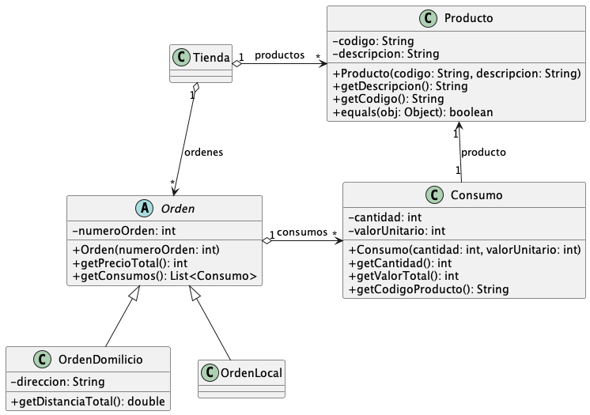

# Solución del Parcial 3 2023-3

## 1. Conceptos (10 puntos)

1. ¿Java permite la sobreescritura de métodos `private`?
   - a) Falso
   - b) Verdadero
   

      
Ver respuesta

      a) Falso
   
 

2. ¿Se puede declarar un método abstracto con visibilidad `private`?
   - a) Falso
   - b) Verdadero
   

      
Ver respuesta

      a) Falso
   
 

3. ¿Java permite la declaración de métodos abstractos con la palabra reservada `final`?
   - a) Falso
   - b) Verdadero
   

      
Ver respuesta

      a) Falso
   
 

4. ¿Una clase `abstract` puede ser instanciada?
   - a) Falso
   - b) Verdadero
   

      
Ver respuesta

      a) Falso
   
 

5. ¿Se pueden declarar métodos no abstractos dentro de una clase abstracta?
   - a) Falso
   - b) Verdadero
   

      
Ver respuesta

      b) Verdadero
   
 

6. ¿Qué ocurre si una clase hija declara un método con el mismo nombre pero diferente número o tipo de parámetros que un método de la clase padre?
   - a) Se produce una sobrecarga del método
   - b) Se produce una sobreescritura del método
   - c) Se produce una invocación del método
   - d) Se produce una ocultación del método
   

      
Ver respuesta

      a) Se produce una sobrecarga del método
   
 

7. Cuando un método es invocado sobre un objeto de una clase hija (es decir, que hereda de otras clases), ¿qué determina cuál implementación del método es utilizada en tiempo de ejecución?
   - a) Depende de si el método es tipo `super` o tipo `heir`
   - b) Siempre se ejecuta la implementación que esté más arriba en el árbol de herencia
   - c) Siempre se ejecuta la implementación que esté más abajo en el árbol de herencia
   - d) Depende de si la superclase es abstracta o no
   

      
Ver respuesta

      c) Siempre se ejecuta la implementación que esté más abajo en el árbol de herencia
   
 

8. ¿Qué concepto de la programación orientada a objetos se refiere específicamente a la capacidad de diferentes tipos de datos de ser tratados como un solo tipo a través de una interfaz común?
   - a) Encapsulación
   - b) Herencia
   - c) Abstracción
   - d) Polimorfismo
   

      
Ver respuesta

      d) Polimorfismo
   
 

9. ¿Cómo se declara un método abstracto en una clase abstracta en Java?
   - a) `abstract void miMetodo();`
   - b) `public void abstract miMetodo();`
   - c) `void abstract miMetodo();`
   - d) `public abstract void miMetodo();`
   

      
Ver respuesta

      d) `public abstract void miMetodo();`
   
 

10. ¿En Java, qué debe hacer una clase no abstracta si hereda de una clase abstracta que tiene métodos abstractos?
    - a) Nada
    - b) Debe sobrescribir y proporcionar una implementación para todos los métodos abstractos de la clase base
    - c) Debe declarar todos los métodos abstractos de la clase base como abstractos de nuevo
    - d) Declarar e implementar un constructor por parámetros
    

       
Ver respuesta

       b) Debe sobrescribir y proporcionar una implementación para todos los métodos abstractos de la clase base
    
 

## 2. La Tienda Virtual (80 puntos)

### 2.1 Definición de clases y atributos (20 puntos)

Defina las clases representadas en el siguiente diagrama UML. Tenga en cuenta que solo debe hacer el encabezado de las clases con sus atributos, pero **no el de los métodos.**

Puede suponer que todos los métodos incluidos en este diagrama de clases ya están implementados y funcionan correctamente. No deben ser implementados. También puede suponer que:

1. **Órdenes locales**: Son órdenes que se entregan en el local de la tienda.
2. El método `getPrecioTotal()` de la clase `Orden` **no es abstracto** y retorna la sumatoria de los valores totales de los consumos de la orden. Puede asumir que ya está implementado.
3. El método `equals()` de la clase `Producto` retorna `true` si los productos tienen el mismo código, o `false` en caso contrario.

### 2.2. (70 puntos) Definición de métodos

Desarrolle los siguientes métodos en las clases definidas anteriormente:

| Clase              | Pts | Descripción                                                                                                                                                                                                                                                                                                                                                                                                                                                              |
|--------------------|-----|--------------------------------------------------------------------------------------------------------------------------------------------------------------------------------------------------------------------------------------------------------------------------------------------------------------------------------------------------------------------------------------------------------------------------------------------------------------------------|
| **Tienda**         | 15  | [Un método que importe todos los productos de la tienda desde un archivo serializado](./src/main/java/com/company/model/Tienda.java#L55). Este método recibe como único parámetro la ruta a un archivo que contiene una secuencia serializada de productos. **Los productos están uno por uno en el archivo**. Este método debe arrojar una excepción si encuentra productos con códigos repetidos en el archivo. En este caso, la lista de productos debe quedar vacía. |
| **OrdenDomicilio** | 5   | [Sobrescribir el método `getPrecioTotal()` definido en la clase `Orden`](./src/main/java/com/company/model/orden/OrdenLocal.java#L12), agregando un descuento progresivo de 1% por cada $50.000 pesos en compras. El descuento máximo es de 15%.                                                                                                                                                                                                                         |
| **OrdenDomicilio** | 5   | [Sobrescribir el método `getPrecioTotal()` definido en la clase `Orden`](./src/main/java/com/company/model/orden/OrdenDomicilio.java#L33), agregando costos de envío de $3.000 por cada kilómetro (o fracción) de distancia entre la tienda y la dirección de entrega. Esta distancia la puede calcular con el método `getDistanciaTotal` (puede asumir que este método ya está implementado y funciona correctamente).                                                  |
| **OrdenDomicilio** | 5   | [Un constructor por parámetros para la clase](./src/main/java/com/company/model/orden/OrdenDomicilio.java#L9).                                                                                                                                                                                                                                                                                                                                                           |
| **Tienda**         | 5   | [Un método `getTotalVentas`](src/main/java/com/company/model/Tienda.java#L126) que retorne la sumatoria de precios totales de todas las órdenes del sistema.                                                                                                                                                                                                                                                                                                             |
| **Tienda**         | 10  | [Un método `getIngresoDomicilio`](./src/main/java/com/company/model/Tienda.java#L149) que retorne cuánto dinero ha ganado la tienda por los costos de envío de las órdenes a domicilio.                                                                                                                                                                                                                                                                                  |
| **Tienda**         | 25  | [Un método `getMasVendido`](./src/main/java/com/company/model/Tienda.java#L185) que retorne el código del producto más vendido (es decir, del que se vendió la mayor cantidad de unidades) en la tienda, o `null` si no hay órdenes registradas.                                                                                                                                                                                                                         |

### Notas adicionales:

- Para cualquiera de estos métodos puede usar métodos desarrollados en otros puntos del parcial.
- En caso de usar métodos adicionales o auxiliares que no estén incluidos en este enunciado, debe implementarlos completamente.
